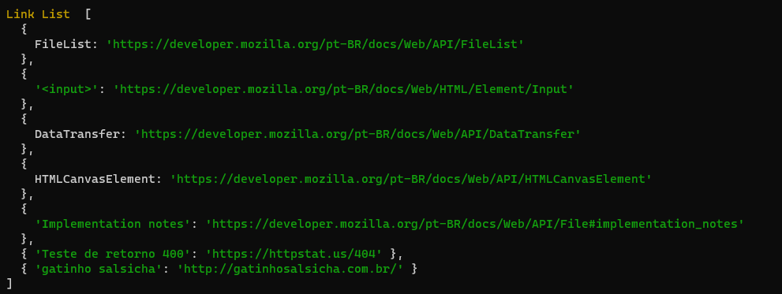
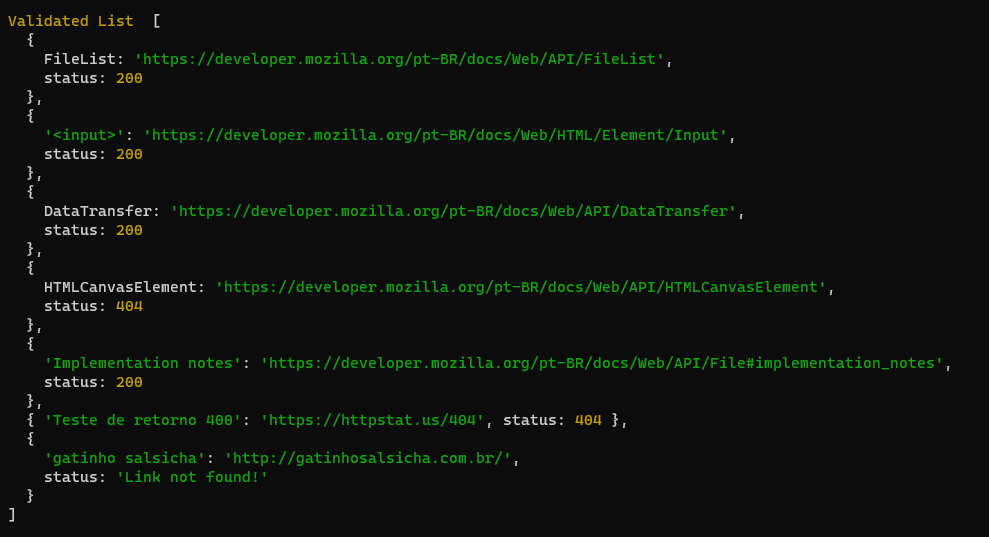

# My Own Lib
Projeto criado através do curso **Criando sua primeira biblioteca** na Alura Cursos.

O Curso tem como finalidade abordar os principais conceitos do Javascript como:

* Como ler arquivos usando a biblioteca **fs** nativa do javascript.
* Entender os conceitos de callback, promisses e async/await.
* Utilizar requisições **async / await** no código.
* Realizar tratamento de erros.
* Utilizar o **try / catch**.
* Entender expresões regulares e como montá-las.
* Capturar links com expressões regulares.
* Utilizando linha de comando para capturar e utilizar dados informados no terminal.
* Como criar comandos CLI para executar tarefas.
* Como fazer requisições utilizando API **fetch** e manipular dados com código HTTP.
* Utilizar o método **Promise.all** para acessar de forma assíncrona um array de URLs e receber seu resultado.
* Validar links através do Status Code retornado.

### In English:

Project created through the course **Criando sua primeira biblioteca** at Alura Cursos.

The course aims to cover the main concepts of Javascript such as:

* How to read files using the native javascript **fs** library.
* Understand the concepts of callback, promises and async/await.
* Use of **async / await** requests in the code.
* Perform error handling.
* Use of **try / catch**.
* Understand regular expressions and how to assemble them.
* Capture links with regular expressions.
* Using command line to capture and use data entered in the terminal.
* How to create CLI commands to perform tasks.
* How to make requests using the **fetch** API and manipulate data with HTTP code.
* Use of the **Promise.all** method to asynchronously access an array of URLs and receive their results.
* Validate links using the returned Status Code.


## Sobre a biblioteca

Esta biblioteca tem como finalidade capturar links em um arquivo de texto e verificar se é válido.

## Rodando a biblioteca localmente
````bash
# Clone este repositório
$ git clone https://github.com/cleosilva/my-lib.git

# Acesse a pasta pelo terminal
$ cd my-lib

# Instale as dependências
$ npm install
````

 Há dois métodos de rodar a biblioteca a primeira é retornando a lista de links sem validação e a segunda é retornando a lista de links com validação. Verifique os comando abaixo:

````bash
# Retornando a lista de links sem validação. Rode o comando abaixo passando o caminho do arquivo que será lido.
$ npm run cli ./files/text.md

# Retornando a lista de links com validação
$ npm run cli:valid
````

O retorno será parecido com as imagens abaixos:

**Retorno sem validação:**



**Retorno com validação:**

